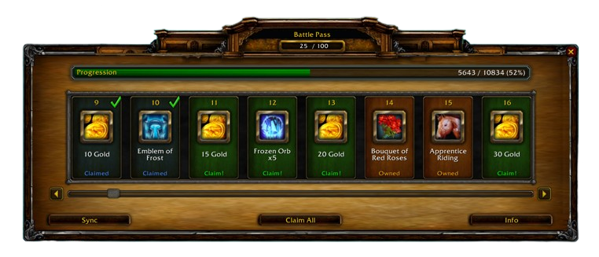

# Battle Pass System for AzerothCore



A complete Battle Pass progression system for AzerothCore 3.3.5a with ALE.

## Features

- Configurable XP sources (kills, quests, PvP, dungeons, etc.)
- Multiple reward types: items, gold, titles, spells
- In-game addon UI for tracking progress
- NPC vendor for players without addon
- Admin commands for management
- Client-server communication via CSMH library

## Requirements

- AzerothCore with ALE Lua Engine
- WoW Client 3.3.5a (12340)

## Installation

### Server Setup

1. Copy `lua_scripts/` contents to your server's `lua_scripts/` folder:
   ```
   lua_scripts/
   ├── lib/CSMH/           # Communication library
   └── battlepass/         # Battle Pass modules
   ```

2. Execute SQL files on your databases:
   ```sql
   -- On acore_world database:
   SOURCE sql/battlepass_world.sql;

   -- On acore_characters database:
   SOURCE sql/battlepass_characters.sql;
   ```

### Client Addon

Copy `BattlePassAddon/` folder to your WoW `Interface/AddOns/` directory or include it in a MPQ patch with the same hierarchy.
`/bp` or `/battlepass` ingame to toggle the frame.

## Configuration

Edit values in `battlepass_config` table:

| Key | Default | Description |
|-----|---------|-------------|
| enabled | 1 | Enable/disable system |
| max_level | 100 | Maximum Battle Pass level |
| exp_per_level | 1000 | Base XP per level |
| exp_scaling | 1.1 | XP scaling factor |
| npc_entry | 90100 | NPC vendor entry ID |
| debug_mode | 0 | Enable debug logging |

## Commands

### Player Commands
- `.bp` - Show status
- `.bp rewards` - List available rewards
- `.bp claim <level>` - Claim a reward
- `.bp claimall` - Claim all rewards
- `.bp preview [level]` - Preview levels

### Admin Commands (GM rank 2+)
- `.bpadmin addxp <amount> [player]`
- `.bpadmin setlevel <level> [player]`
- `.bpadmin unclaim <level> [player]`
- `.bpadmin reset [player]`
- `.bpadmin reload`
- `.bpadmin stats`

## Customization

### Adding Rewards

Insert rows into `battlepass_levels`:

```sql
INSERT INTO battlepass_levels (level, reward_type, reward_id, reward_count, reward_name, reward_icon)
VALUES (31, 1, 49426, 10, 'Emblem of Frost x10', 'Spell_Holy_SummonChampion');
```

Reward types:
- 1 = Item (reward_id = item entry, reward_count = quantity)
- 2 = Gold (reward_count = copper amount)
- 3 = Title (reward_count = title ID)
- 4 = Spell (reward_id = spell ID)
- 5 = Currency item

### Progress Sources

Available XP sources with automatic tracking:

| Source Type | Description |
|-------------|-------------|
| KILL_CREATURE | Any creature kill |
| KILL_ELITE | Elite creature kill (rank >= 1) |
| KILL_BOSS | Dungeon/Raid boss kill |
| COMPLETE_QUEST | Any quest completion |
| COMPLETE_DAILY | Daily quest completion |
| PLAYER_LEVELUP | Player gains a level |
| WIN_BATTLEGROUND | Battleground victory |
| LOSE_BATTLEGROUND | Battleground participation (loss) |
| HONOR_KILL | Honorable kill in PvP |
| LOGIN_DAILY | First login of the day |
| CUSTOM | Custom events via admin command |

### Adding Custom XP Sources

Insert rows into `battlepass_progress_sources`:

```sql
INSERT INTO battlepass_progress_sources (source_type, source_subtype, exp_value, description)
VALUES ('KILL_CREATURE', 36597, 1000, 'Lich King kill bonus');
```

## File Structure

```
mod-battlepass/
├── README.md
├── sql/
│   ├── battlepass_world.sql      # World DB tables
│   └── battlepass_characters.sql # Characters DB table
├── lua_scripts/
│   ├── lib/CSMH/
│   │   ├── SMH.lua               # Server message handler
│   │   └── smallfolk.lua         # Serialization library
│   └── battlepass/
│       ├── 01_BP_Core.lua        # Core initialization
│       ├── 02_BP_Database.lua    # Database operations
│       ├── 03_BP_Progress.lua    # XP/level logic
│       ├── 04_BP_Rewards.lua     # Reward distribution
│       ├── 05_BP_Communication.lua # Client sync
│       ├── 06_BP_Events.lua      # Game event hooks
│       ├── 07_BP_Commands.lua    # Chat commands
│       └── 08_BP_NPC.lua         # NPC gossip
└── BattlePassAddon/
    ├── BattlePass.toc
    ├── BattlePass.xml
    ├── BattlePass.lua
    ├── CMH.lua                   # Client message handler
    └── smallfolk.lua             # Serialization library
```

## License

MIT License
